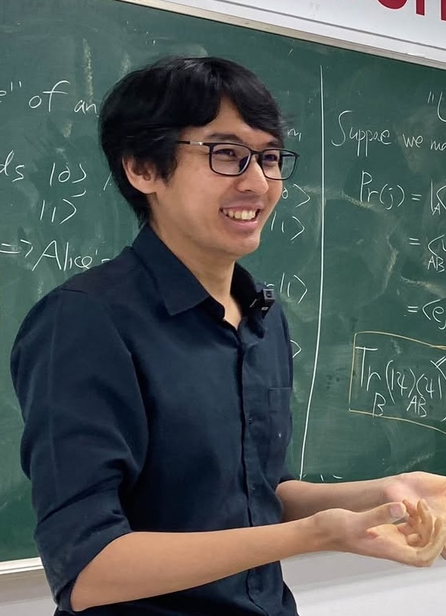
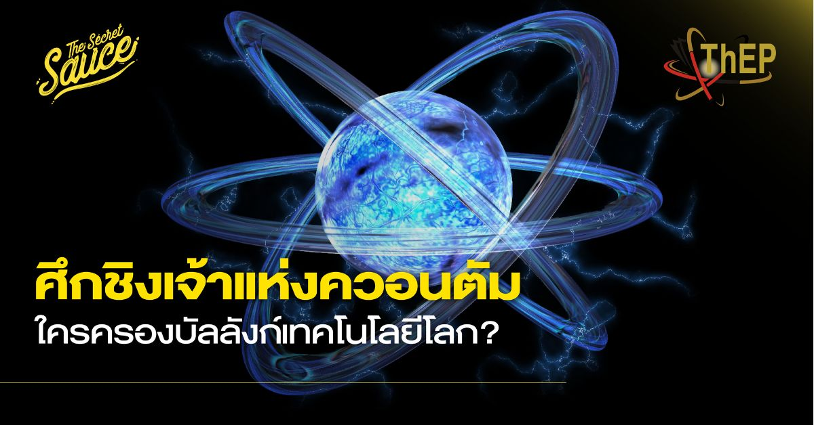
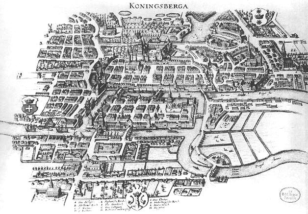

::: {.profile-grid}

::: {.profile-sidebar}
{.profile-photo}

::: {.profile-name}
Ninnat Dangniam
(นินนาท แดงเนียม)
:::

*Assistant Professor*

The Institute for Fundamental Study (IF)

Naresuan University, Thailand

::: {.profile-links}
- [Email](mailto:ninnatd@nu.ac.th)
- [Google Scholar](https://scholar.google.com/citations?user=pfEfAq4AAAAJ)
:::
:::

::: {.profile-main}

I'm a theoretical physicist working in quantum information science, currently an Assistant Professor at IF, Naresuan University. For research, publications and group members, see the [QIS Group](group/index.qmd) page. Below are teaching materials and Thai outreach content for general readers.

## Teaching & Resources

::: {.resource-entry}
**Effective Learning** — [slides](https://slides.com/ninnat/effective-learning){.tag-inline}

::: {.course-desc}
A talk on effective study habits and the science of learning, for students starting a demanding program.
:::
:::

Course materials and lecture notes

::: {.course-list}

::: {.course-entry}
**Invitation to Quantum Computer Science** — [notes](https://www.dropbox.com/scl/fi/fuodw7539effrb65dw1wk/QI4_IFSummer2026_5Jun2026.pdf?rlkey=e6v06pbcu409gemi8048fia8k&dl=0){.tag-inline}


::: {.course-desc}
IF Summer School, est. 2022 · 1 of 4 QIS modules
:::

:::


::: {.course-entry}
**Quantum Computation** (2024) — [github](https://github.com/Ninnat/qcomp-2-2024){.tag-inline}

<!---
::: {.course-desc}
*Graduate-level; 3 parts: computational models, quantum algorithms and rudimentary complexity theory, quantum error correction up to the toric code; solutions available upon request* 
[notes](https://github.com/Ninnat/qcomp-2-2024/blob/main/surface-codes.pdf){.tag-inline}.
*(example description — replace with the real one, or delete this `.course-desc` div if you don't want one for a given course.)*
:::
--->

:::

::: {.course-entry}
**Quantum Information** (2024) — [github](https://github.com/Ninnat/qinfo-1-2024){.tag-inline} [video lectures](https://www.youtube.com/playlist?list=PLgUEDBpK9d1JlvOfm2XljpfwRX4F5uLEI){.tag-inline}

<!---
::: {.course-desc}
*Graduate-level; review of classical probability and linear algebra, quantum states, generalized measurements and dynamics, classical and quantum compression*
:::
--->


:::

::: {.course-entry}
**Quantum Mechanics** (2023) — [github](https://github.com/Ninnat/quantum-mechanics-1-2023){.tag-inline}

::: {.course-desc}
Extra notes on spherical tensor operators[notes](https://www.dropbox.com/scl/fi/10slr39t4curpl4izw6e1/spherical_tensor_operator.pdf?rlkey=7q9r5na3a56akuwl3l5wwm06k&dl=0){.tag-inline}
:::
:::

::: {.course-entry}
**Statistical Mechanics** (2022, 1st half · co-taught) — [github](https://github.com/Ninnat/M897513-stat-mech-2-2565){.tag-inline}

:::

::: {.course-entry}
**Classical Electrodynamics** (2021, 1st half · co-taught) — [notes](https://www.dropbox.com/scl/fi/gwyblj313ehu3nxii68gn/Classical-Electrodynamics-2_2021.pdf?rlkey=an0xgjisq30a8x3ixrlgv6xjf&dl=0){.tag-inline}

:::

:::

## Thai Outreach & Educational Content

*เสวนาสาธารณะและบทความภาษาไทยสำหรับผู้อ่านทั่วไป*

```{=html}
<div class="talks-grid">

<div class="talk-card">
<a href="https://www.youtube.com/watch?v=PCuagjxj4qI">

<p><strong>When Quantum Mechanics Meets Secrecy</strong><br>IF Public Talk &middot; Apr 2026</p>
</a>
</div>

<div class="talk-card">
<a href="https://www.youtube.com/watch?v=8RnF_Ffl-EY">

<p><strong>ควอนตัม ที่ไม่เล็กอีกต่อไป <br> Quantum weirdness in centimeter scale</strong><br>NU Research World Café &middot; Dec 2025</p>
</a>
</div>

<div class="talk-card">
<a href="https://thestandard.co/the_secret_sauce/quantum-computing-power-race/">

<p><strong>ศึกชิงเจ้าแห่งควอนตัม ใครครองบัลลังก์เทคโนโลยีโลก?</strong><br>Invite Article, <em>The Standard</em> &middot; Aug 2025</p>
</a>
</div>


<div class="talk-card">
<a href="https://www.youtube.com/watch?v=ZTTVYb0zp5E">

<p><strong>Quantum is so damn &lsquo;spooky&rsquo;, but there is no return to classical reality</strong><br>IF Public Talk &middot; Oct 2022</p>
</a>
</div>

<div class="talk-card">
<a href="https://www.youtube.com/watch?v=gZ8zpf1QadQ">

<p><strong>Dancing with Qubits: How they can change the world</strong><br>IF Public Talk &middot; Oct 2022</p>
</a>
</div>

<div class="talk-card">
<a href="projects/items/2017-quantum-algorithm-layperson.html">

<p><strong>ขั้นคิดคำนวณแบบควอนตัม</strong><br>บทความบล็อก &middot; Aug 2017</p>
</a>
</div>

<!---
<div class="talk-card">
<a href="https://www.youtube.com/watch?v=tyL1RLf9Qx4">

<p><strong>&ldquo;Doing Quantum Computing Research as Theoretical Physicists&rdquo;</strong><br>IF &amp; QTFT MOU Signing Ceremony &middot; Feb 2022</p>
</a>
</div>
--->

</div>
```
<!---
*This is the full record of talks and invited writing — I don't carry them over to [Projects](projects/index.qmd), which is papers, preprints and essays only. The essay above is the exception: it lives on both.*
--->

::: {.colophon}
The site is built with [Quarto](https://quarto.org/), an open-source scientific and technical publishing system, with help from Claude Sonnet 5 (Anthropic), September 2026. Aesthetics and design choices are heavily inspired by [Gwern](https://gwern.net/).
:::

:::

:::

